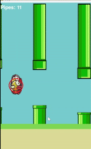

# CS Portfolio

Welcome to my Computer Science portfolio! This repository contains a collection of my programming projects, showcasing my skills in Python, artificial intelligence, automation, and more.

## Projects

### 1. Flappy Bird AI
**Location:** `Flappy Bird/src`

A Python implementation of Flappy Bird with an AI agent that learns to play the game using a neural network and genetic algorithm. The project uses Pygame for graphics and Numpy for neural network operations.

- **Preview:**
  

- **Features:**
  - AI-controlled bird learns to play Flappy Bird autonomously.
  - Neural network and genetic algorithm for evolving gameplay strategies.
  - Visual and headless (fast) training modes.

- **How to Run:**
  1. Install dependencies:
     ```bash
     pip install -r requirements.txt
     ```
  2. Run the game:
     ```bash
     python Flappy Bird/src/flappy_ai.py
     ```

- **Requirements:** Python 3.7+, Pygame, Numpy

---

### 2. Instagram Poster (Automated Meme Generator & Uploader)

This project is a sophisticated Python automation tool designed to autonomously generate and post political memes to Instagram. It leverages cutting-edge AI models to create unique content and integrates seamlessly with the Instagram Graph API for automated publishing.

**Key Features:**
*   **AI-Powered Content Generation:** Utilizes OpenAI's GPT-4.1-mini for meme idea and caption generation, and gpt-image-1 for image creation based on current political headlines.
*   **Automated Image Processing:** Handles image resizing and optimization for Instagram's specifications using the Pillow library.
*   **Robust API Integration:** Communicates with the Facebook Graph API for secure and reliable posting to a linked Instagram Business Account.
*   **Continuous Integration & Deployment (CI/CD):** Configured with GitHub Actions to automate testing on Pull Requests and schedule daily meme generation and posting.

**Preview of the Instagram Account:**  
  
*Follow the account:* **[@ai_memes_fun](https://instagram.com/ai_memes_fun)**

**Technologies Used:**
*   Python
*   OpenAI API (GPT-4.1-mini, gpt-image-1)
*   Facebook Graph API
*   Pillow (PIL)
*   Requests
*   Pytest (for testing)
*   GitHub Actions (for CI/CD)

**Setup and Local Execution:**

To set up and run this project locally, follow these steps:

1.  **Clone the repository:**
    ```bash
    git clone https://github.com/chendry10/cs-portfolio.git
    cd cs-portfolio/Automated_AI_Instagram
    ```
2.  **Create a virtual environment (recommended):**
    ```bash
    python -m venv venv
    source venv/bin/activate  # On Windows: .venv\Scripts\activate
    ```
3.  **Install dependencies:**
    ```bash
    pip install -r requirements.txt
    ```
4.  **Configure Environment Variables:**
    Create a `.env` file in the `Automated_AI_Instagram` directory with your API keys:
    ```
    INSTA="YOUR_INSTAGRAM_ACCESS_TOKEN"
    OPENAI="YOUR_OPENAI_API_KEY"
    ```
    *   **INSTA:** Your Facebook Graph API Access Token with necessary permissions (instagram_basic, instagram_content_publish, pages_read_engagement, pages_show_list, instagram_management). This should be a Page Access Token for your Instagram Business Account.
    *   **OPENAI:** Your OpenAI API Key.

5.  **Run the script locally:**
    ```bash
    python src/main.py
    ```
    To generate only a prompt and caption without posting:
    ```bash
    python src/main.py -p
    ```

6.  **Run the tests locally:**
    ```bash
    python -m pytest tests
    ```

**GitHub Actions Integration:**

This project uses GitHub Actions for automated testing and deployment:

*   `.github/workflows/test_pr.yml`: This workflow runs all automated tests whenever a Pull Request is opened or updated against the `main` branch. This ensures that new code changes do not introduce regressions.
*   `.github/workflows/insta_poster.yml`: This workflow is responsible for the daily, automated generation and posting of memes to Instagram and it runs on a schedule.


